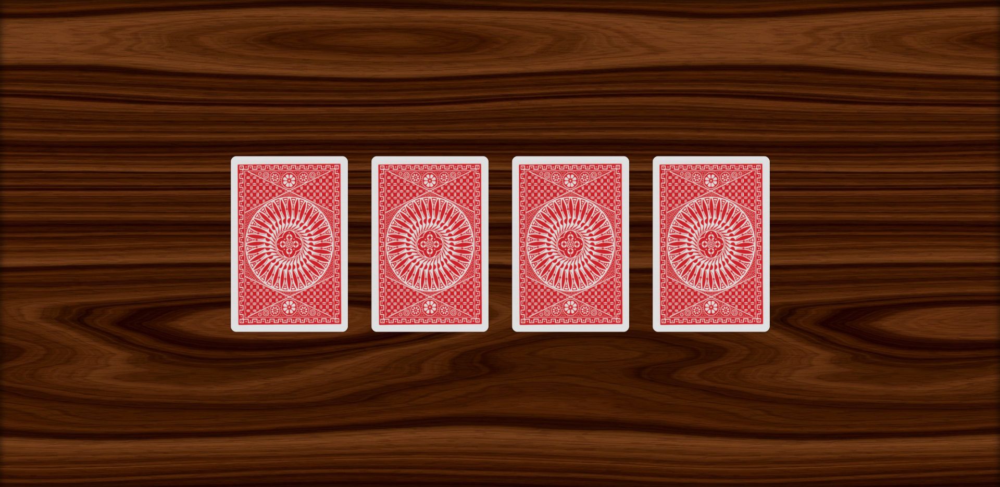

# **CardsLoader**
:sparkles: Анимированный загрузочный экран, представленный в виде перетасовки и раскладки игральных карт.

 

## **Технологии**
Данный сайт написан исключительно на языках HTML5 и CSS3 без использования языков программирования и сторонних библиотек.
Для создания анимаций используется технология keyframes, поддерживаемая в большинстве современных браузеров.

## **Дерево файлов**
Структура сайта состоит из следующих файлов и папок:
- **images** - папка с изображениями:
	- **proofs** - папка со скриншотами сайта;
	- **card_back.png** - рубашка карты;
	- **wooden_background_jpg** - древесная бесшовная текстура для фона экрана в виде стола;
- **styles** - папка с файлами стилей:
	- **main.css** - основной файл стилей;
- **index.html** - главная страница сайта;
- **README.md** - информация о сайте.

## **Используемые переменные**
В файле *main.css* описаны переменные, используемые на странице для облегчения написания и поддержки кода. Их список:
- **--black: #090909** - цвет чёрных элементов карт (пики, крести);
-	**--gray: #DDDDDD** - цвет серых элементов карт (рамки на лицевой стороне);
-	**--red: #C92026** - цвет красных элементов карт (заливка рубашки, черви, буби);
-	**--card-width: 200px** - ширина одной карты (высота рассчитывается из пропрорции ширины к высоте 2 к 3);
-	**--card-space: 40px** - расстояние между двумя картами.

## **Скриншоты**
Сайт работает. Зайдя на него, Вы можете увидеть следующее:

Это базовая раскладка. Немного подождав, Вы увидете, как карточки начинают движение:
